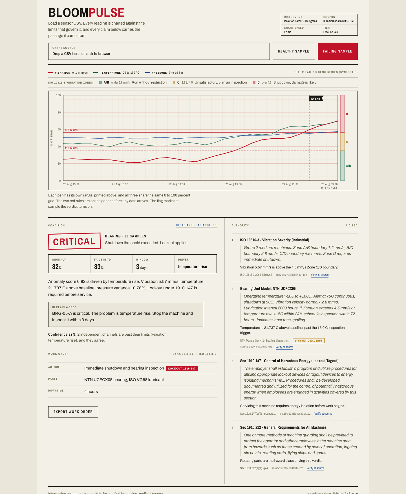

# BloomPulse

[](https://github.com/dgexplores/hyperbloom-bloompulse/actions/workflows/ci.yml) [](https://github.com/dgexplores/hyperbloom-bloompulse/actions/workflows/deploy-verify.yml) [](https://hyperbloom-bloompulse.vercel.app)

**Load a sensor CSV. Get a machine-condition verdict where every claim carries the
passage of the standard it came from.**

No sensors to install, no gateway, no vendor contract, no API key.

**Live: https://hyperbloom-bloompulse.vercel.app**
Straight to a result: [failing machine](https://hyperbloom-bloompulse.vercel.app/?demo=failing) ·
[healthy machine](https://hyperbloom-bloompulse.vercel.app/?demo=healthy)

> Interviewer in 60 seconds: CSV → Isolation Forest (own baseline) + ISO 10816-3 gates → severity + work order, every claim quoted verbatim from `corpus/sources/*.md` with sha. `make test && make eval`, then open the failing link above and check Authority column → Verify at source. Arch: `frontend/` SPA + one FastAPI fn (`api/index.py`), no DB, no key, ~30ms.

**Submit / judge this here: [Hyperbloom September, AI/ML on Devpost](https://hyperbloom-september.devpost.com/)**
Deadline **14 September 2026, 5:00pm EDT**.



Built for the Hyperbloom September AI/ML hackathon. MIT licensed.

---

## In plain words

Say a bearing on a factory machine is starting to fail. It gets hotter and
shakes more than it should, days before it actually breaks. A maintenance
worker exports that sensor log as a CSV, from whatever system already logs it,
and drops it into BloomPulse.

BloomPulse looks at the numbers the same way an experienced technician would:
"is this normal for this machine, and does any of it cross a line the safety
rulebook has already drawn?" It answers with:

- **A verdict**: Normal, Monitor, Alert, or Critical.
- **A reason**: which reading is the problem, and how far past the limit it is.
- **A source**: the exact sentence from the ISO or OSHA standard that
  justifies the verdict, not just "trust the AI."
- **A work order**: what to do about it, downloadable as one file.

If it isn't sure, it says so instead of guessing. No sensor kit, no software to
install, no account, no fee. A CSV file and a browser is the whole requirement.

### The numbers, measured not claimed

| | |
|---|---|
| Response time | about 15ms locally, under 100ms live |
| Tests passing | 55 |
| Healthy machines correctly reported as normal | 98% (196 / 200) |
| Sub-threshold drift caught with no limit breached | 100% (20 / 20) |
| Verdicts matching hand-labelled test cases | 7 / 7, 100% |
| Every citation checked against the source text | 15 / 15, 100% |
| Deployed function size | under Vercel's 225MB limit |
| Cost to run the demo | $0, no key required |

(`make eval` regenerates these from `eval/report.json`, they are measured on
every CI run, not typed in by hand.)

### What this does not claim

- **No failure probability.** Nothing here is calibrated against failure
  events, so the API publishes an `anomaly_index` (0 to 1, distance from the
  machine's own baseline) and an `inspection_window_days` (a policy lookup on
  severity). An earlier revision published a "7 day failure probability" that
  was an affine transform of the anomaly score. It was removed.
- **`span_fidelity` has two tests.** The parser-invariant test (15/15) checks a
  span against the file it was parsed from, which is circular. The second test
  checks every `**Provenance:** published` span against a checked-in reference
  copy of the source text (`corpus/reference/`). A paraphrase cannot sit behind
  a published marker unnoticed, and any later edit to a published span fails the
  suite. `tsc --noEmit` is also in the build.
- **The severity cut is calibrated, not universal.** `eval/calibrate.py` sets it
  from a measured healthy population. It is valid for machines that look like
  that population.
- **Drift needs a baseline to measure against.** Both instruments compare a
  recent window against the series' own opening readings, so a series with fewer
  than 8 readings — or a perfectly flat one — is not modelled at all: the
  published limit gates decide alone and no drift is reported. The trend
  instrument's opening window and recent window only stop overlapping at 13
  readings, so below that its two halves share rows and it is a weaker signal.
  The cuts are set for machines whose normal wandering looks like the measured
  population; a machine far noisier or far quieter than anything in it sits on
  the wrong side of the cut.

---

## Status: what's done, what's left

**Done.** Backend hardened (13 defects fixed), then a calibration pass that
found and fixed 6 more, then a second pass that added a second drift instrument
and closed the smooth-ramp blind spot (see §5.8). 55 tests, CI, a measured eval,
deployed and verified live, and the submission mapped to the real judging
criteria.

**Left, and only the project owner can finish these:**

- [ ] **Record the demo video.** `docs/DEMO_GUIDE.md` is a ready shot-by-shot
      script, 90 seconds, against the live site.
- [ ] **List team members** on the Devpost submission page.
- [ ] **Submit** on [Devpost](https://hyperbloom-september.devpost.com/) before
      **14 September 2026, 5:00pm EDT**.
- [ ] Fill out the post-event survey once it opens.
- [ ] Confirm eligibility: student, above the age of majority where you live.

See section 6 for smaller, optional engineering follow-ups that do not block
submission.

---

## 1. What it does

```
Sensor CSV (timestamp, temperature_c, vibration_mm_s, [pressure_bar, rpm])
  -> two drift instruments, each fitted on the opening slice as a baseline:
       Isolation Forest  (a channel that has gone erratic)
       trend z-score     (a channel that has simply moved)
  -> ISO 10816-3 / NTN threshold gates layered on top
  -> severity + inspection window + driving channel
  -> offline extractive citations (verbatim span, locator, deep link, version hash)
  -> work order + plain-language summary + confidence, with an abstain floor
```

Three layers that check each other. Two model instruments score drift from the
machine's own baseline — the forest for a channel that has gone erratic, the
trend test for one that has simply moved. Fixed published thresholds gate the
result, so a genuine physical breach escalates whatever the unsupervised models
think. Retrieval is offline and extractive against a git-tracked corpus, so the
tool quotes a standard rather than paraphrasing one.

---

## 2. Quick start

Python 3.12 or newer. The pinned versions all publish wheels for 3.12, 3.13
and 3.14, and the suite is run against 3.12 and 3.14.

```bash
# Backend
uv venv --python 3.12 .venv
uv pip install --python .venv/bin/python -r requirements-dev.txt
PYTHONPATH=. .venv/bin/python -m uvicorn backend.app.main:app --reload --port 8000
# http://localhost:8000/docs  and  http://localhost:8000/health
```

```bash
# Frontend, in a second terminal
cd frontend && npm install && npm run dev
# Vite prints the port. Set VITE_API_URL if the API is not on :8000.
```

```bash
# Tests
PYTHONPATH=. .venv/bin/python -m pytest tests/ -q     # 55 tests
PYTHONPATH=. RATE_LIMIT_PER_MINUTE=0 .venv/bin/python eval/run_eval.py

# Regenerate the sample CSVs
PYTHONPATH=. .venv/bin/python model/sample_data.py
```

Upload check:

```bash
curl -X POST "http://localhost:8000/api/v1/pulse/upload?equipment_id=BRG-05-A" \
  -F file=@model/sample_anomaly.csv | jq '.anomaly.severity, .confidence.score'
# -> "critical"  92
```

---

## 3. API

| Endpoint | Body | Returns |
|---|---|---|
| `POST /api/v1/pulse/analyze` | `{equipment_id, equipment_type, readings[]}` | `PulseResponse` |
| `POST /api/v1/pulse/upload?equipment_id=` | multipart `file=<csv>` | `PulseResponse` |
| `GET /api/v1/corpus/version` | | corpus version |
| `GET /api/v1/health`, `GET /health` | | status, version, corpus version |

In production only `/api/*` reaches Python, because everything else rewrites to
the SPA. Use `/api/v1/health` for probes.

`PulseResponse` carries `anomaly`, `readings` (the exact series that was
scored), `citations[]`, `confidence`, `work_order`, `corpus_version`,
`disclaimer` and `latency_ms`. Contracts live in
`backend/app/models/schemas.py`.

**Limits.** 500 rows, 2MB, UTF-8. Required columns are `timestamp`,
`temperature_c` and `vibration_mm_s`. Everything else is optional and defaulted.

**Auth.** Open by default, because the public demo is keyless and a browser
bundle cannot hold a secret. Set `API_KEY` to require a bearer token or
`x-api-key` header on `/api/*`. Set `CORS_ORIGINS` to a comma-separated
allowlist to close CORS.

---

## 4. Repo layout

```
backend/app/
  main.py           FastAPI app, CSV ingest and validation, confidence, work order
  models/schemas.py Pydantic contracts
  rag/citations.py  parses verbatim spans out of the corpus files
model/
  anomaly.py        BloomPulseAnomaly engine, score_readings()
  iforest.py        Isolation Forest on numpy, no scikit-learn at runtime
  sample_data.py    synthetic CSV generator
corpus/
  manifest.json     version and real sha256 per source file
  build_manifest.py regenerate the manifest after editing a source
  sources/*.md      OSHA, ISO and manufacturer excerpts, parsed at import
eval/
  run_eval.py       measured metrics, writes report.json
frontend/src/
  main.tsx          the page
  ChartRecorder.tsx hand-drawn strip-chart SVG, no chart library
  api.ts            typed client
  ErrorBoundary.tsx
  styles.css        the visual world
tests/
  test_bloompulse.py  API, ingest, corpus and confidence
  test_iforest.py     the forest checked against scikit-learn
PRODUCT.md          durable product truth
DESIGN.md           the built visual system
```

---

## 5. Build status

A hardening and redesign pass is **complete**. 55 tests, a measured eval, and CI
on every push.

### 5.1 Backend: 13 defects fixed

| # | Defect | Symptom before the fix |
|---|---|---|
| 1 | Module-level `IsolationForest` singleton | Fitted on the first request's data and never refitted. A series' score depended on which file was scored before it. |
| 2 | Seven unhandled crash paths in CSV upload | Missing column, non-numeric cell, empty file, header-only file, over-length file, non-UTF8 bytes and binary uploads all returned **500** with a raw traceback. |
| 3 | `contributing_feature` compared raw units | Millimetres per second against degrees against percent, so the largest number won regardless of significance. |
| 4 | Degenerate short or flat series | A single healthy reading, or a flat series, scored 0.5 and reported `monitor` for a healthy machine. |
| 5 | Confidence conflated with severity | A clean machine reported "45%, abstain", which reads as a broken tool. |
| 6 | `backend/app/core/config.py` was dead | Declared Postgres, Redis and pgvector the app never uses. Deleted. |
| 7 | Bare `except:` in `citations.py` | Swallowed `KeyboardInterrupt` and `SystemExit`. |
| 8 | CORS wildcard with credentials | Invalid per the CORS spec, browsers reject it. |
| 9 | API key compared with `!=` | Now `hmac.compare_digest`. |
| 10 | No exception handler, no logging | Internal errors leaked to clients. |
| 11 | A `normal` verdict returned zero citations | The all-clear was the one claim with no source. |
| 12 | The client re-parsed the CSV | A naive `split(',')` broke on CRLF and quoted fields and drifted from the server. The response now echoes `readings`. |
| 13 | Verdict copy contradicted itself | A healthy machine read "The main problem is vibration. Nothing to do, keep it running", and a temperature drop rendered as "within -0.162 C of baseline". |

Two more found by the eval and fixed:

- A breached published limit was downgraded to a 60% abstention when the series
  was too short or too flat to model. A limit is a measurement, not an
  inference, so it now stands on its own.
- `model/sample_data.py` wrote to hard-coded absolute paths, and was unseeded,
  so regenerating the samples silently changed the demo.

### 5.2 The corpus is now load-bearing

Previously the citation spans were hard-coded in a Python dict and
`corpus/sources/*.md` was decorative, while `manifest.json` carried
`placeholder-hash-*` strings. Now:

- Spans are **parsed verbatim** out of `corpus/sources/*.md` at import. Eight
  passages, keyed by heading.
- `version_hash` on every citation is the real sha256 of the file the span came
  from.
- `corpus/build_manifest.py` regenerates the manifest with real digests, and CI
  fails if the manifest and the files disagree.
- `corpus_version` on every response is the declared label **plus a short rollup
  digest** over all source files, e.g. `bloompulse-2026.08.31-v1+a1b2c3d4`. The
  label alone is hand-written and cannot distinguish two corpora — edit a source
  file and it stays put — so the digest is what makes the version identify its
  content. A test pins the two together.
- A test asserts **every span appears verbatim in a corpus file**. A span that
  is not in the corpus was invented, and the suite catches it.
- Excerpts written for the demo are flagged `synthetic` and render with a
  SYNTHETIC EXCERPT marker, so they are never mistaken for published text.
- Each citation carries `applies_to`, one line saying why it was attached to
  this particular verdict.

### 5.3 Frontend: rebuilt

- **Direction: multi-pen strip-chart recorder.** Chart paper with a printed
  grid, ISO 10816-3 zone bands and both alarm limits printed *before* any data
  arrives. Three pens draw at constant chart speed. An event flag marks the
  sample the verdict turns on. Contract is at the top of `frontend/index.html`.
- Light surface, chosen from the use scene, not category habit.
- **Dropped `recharts`, `framer-motion` and `motion`.** The chart is hand-drawn
  SVG and the motion is CSS. React is the only runtime dependency, 52KB gzipped.
- `VITE_API_KEY` removed. A key in a browser bundle is not a secret.
- Chart positions come from elapsed time, so an irregular record shows its gaps,
  and labels carry the date once a series runs past 24 hours.
- Strict TypeScript, an error boundary, real empty, loading, error, abstain and
  synthetic states, focus rings, reduced-motion and print stylesheets.
- Impeccable design detector: clean.
- `DESIGN.md` records the built system.

### 5.4 Measured, not asserted

`make eval` runs labelled fixtures and writes `eval/report.json`. The previous
version hard-coded `faithfulness: 1.0`.

| Metric | Value | What it means |
|---|---|---|
| `healthy_fp_rate` | 0.02 (4/200) | Healthy machines wrongly reported as not normal. This is the number that matters most. |
| `drift_detection` | 1.0 (20/20) | Sub-threshold drift escalated with no published limit breached. The one thing the model does that the gates cannot. |
| `severity_accuracy` | 1.0 (7/7) | Agreement with hand-labelled fixtures |
| `citation_coverage` | 1.0 | Every verdict carries at least one source |
| `span_fidelity` | 1.0 (15/15) | Spans round-trip through the parser, plus every published span is checked against a checked-in reference copy of the source text. A paraphrase cannot sit behind a published marker. |
| `abstention_rate` | 0.29 | Only the genuinely ambiguous cases |
| `latency_ms` p50 | ~15 ms | About 40 to 70ms on the deployed function |

Fixtures include a stuck flat sensor and a Zone C creep, which are the two cases
that used to be scored wrong.

Two independent instruments decide drift, and `eval/calibrate.py` sets the two
cuts for each of them from the healthy population in
`eval/healthy_population.py`. A test fails if any cut stops matching its
measurement, so the score cannot silently drift back to flagging healthy
machines. The forest catches a channel that has gone erratic; the trend test
catches one that has simply moved. Each covers the other's blind spot, which is
why drift detection went from 18/20 to 20/20 — see §5.8.

### 5.5 Infrastructure

- **CI** (`.github/workflows/ci.yml`): pytest, the eval, a manifest-freshness
  check, a requirements-drift check, and `tsc --noEmit && vite build`.
- Rate limiting on the analyse endpoints, `RATE_LIMIT_PER_MINUTE`, default 60,
  bucketed per forwarded client. `TRUSTED_PROXY_HOPS` declares how many proxies
  sit in front of the process.
- `Makefile` rewritten around the real layout.
- `.gitignore` no longer shadows `.env.example`.
- `backend/requirements.txt` deleted. It had drifted to different pins
  (`fastapi==0.115.0` against the root's `0.110.0`). Root and `api/` are now
  identical and CI enforces it.

---

### 5.6 Deployment

Live at **https://hyperbloom-bloompulse.vercel.app**. Frontend is static, the
API is one Python serverless function at `api/index.py`.

Four things had to be solved to get it deployed, all of them recorded here
because they are not obvious and cost real time:

1. **Vercel selected CPython 3.14** and ignored the root `.python-version`, so
   `pydantic-core` had no wheel and tried to compile from Rust source. Every
   runtime pin is now on a version that publishes wheels for 3.12 through 3.14,
   so the build no longer depends on which interpreter Vercel picks.
2. **Local virtualenvs were being uploaded**, 177MB each, taking the bundle to
   545MB. `.vercelignore` now excludes them.
3. **scikit-learn does not fit.** It pulls in scipy, and the three together are
   about 200MB unpacked, which left the function at 258MB against a 225MB
   limit. The Isolation Forest is now implemented on numpy in
   `model/iforest.py`, roughly 110 lines, and `tests/test_iforest.py` checks it
   against scikit-learn's implementation: identical normalising constant, at
   least 90% overlap on the top-k most anomalous points, and score correlation
   above 0.9. scikit-learn stays as a dev dependency purely for that comparison.
   Dropping it also made the endpoint faster, from about 155ms to about 40ms.
4. **`.vercelignore` excluded `*.md`**, which silently excluded
   `corpus/sources/*.md`. The corpus *is* those files, so the API returned
   verdicts with zero citations while looking otherwise healthy. Worth
   remembering: the deploy was green and the endpoint returned 200.

Verified against the live deployment: verdict, all four citations with real
digests, the 400 path for a malformed CSV, sample CSV downloads, SPA deep
links, and mobile layout.

### 5.7 Calibration pass: 6 more defects

A second pass, driven by measuring the tool against healthy machines rather than
against its own fixtures, found that the score was not calibrated at all.

| # | Defect | Symptom before the fix |
|---|---|---|
| 14 | Severity cut sat on the model's noise floor | `agg_score < 0.50` was compared against a score whose healthy distribution peaks at 0.49. **41% of healthy machines were reported as `monitor`.** |
| 15 | The model's contribution was discarded by the gates | `agg_score = max(gate, forest)` meant a gate breach threw the forest away. The forest's own score was flat at 0.543 across a 3.5 mm/s vibration sweep, so its only reachable effect was to push healthy machines into the false-positive band. |
| 16 | A "7 day failure probability" that was not one | `failure_probability_7d = score*0.95 + 0.05*(vib/6)`, uncalibrated and unvalidated, shown as "Fails in 7d" on the primary readout. `predicted_failure_days` was a four-value lookup on severity. |
| 17 | Temperature rise under-reported on short series | The baseline was `mean(temps[:8])`, which on a series shorter than eight was the mean of the whole series. An actual 8.55 C rise was reported as 4.38 C. |
| 18 | The `synthetic` flag was a substring search | `"synthetic" in section.lower()`. An invented passage attributed to ISO 55000 was presented as published text. |
| 19 | Rate limiter keyed on the proxy, and grew without bound | Behind Vercel every visitor shared one bucket, so the public demo rate-limited everyone at once. Buckets were never evicted. |

Plus one behavioural fix: `async def upload_csv` called CPU-bound scoring
directly, which blocks the event loop. It is a sync handler now, so FastAPI runs
it in its threadpool.

**How drift is measured now.** An Isolation Forest score has no absolute meaning
— it depends entirely on the series. So the engine asks the model what it thinks
of the data it was trained on, and treats that as this series' own noise floor.
Drift is the recent window standing clear of that floor. `eval/calibrate.py`
sets the two cuts from a measured healthy population
(`eval/healthy_population.py`), and a test fails if they stop matching it.
Healthy false positives went from 41% to 2%.

### 5.8 Second calibration pass: the ramp blind spot

Calibrating the score surfaced the opposite failure — the model was now quiet
about real drift. Measuring against the drift fixtures found why.

| # | Defect | Symptom before the fix |
|---|---|---|
| 20 | The forest structurally cannot see a smooth ramp | An Isolation Forest isolates points unlike their neighbours. Every point on a slow ramp looks ordinary next to the one before it, so a machine heating steadily for two days scored as `normal`. Drift detection was 18/20 and both misses were thermal ramps. |
| 21 | Sub-threshold attribution used the wrong reference | With no gate breached, the named driver came from the whole opening slice's mean and std, mixing a level measure with a movement measure. It could name a channel that had not moved. |

The fix is a second, independent instrument rather than a better forest: per
channel signal-to-noise, how far the recent window has moved in units of how much
this channel normally wanders. It does not care whether the movement is a step or
a ramp. Measured over 400 healthy machines the largest value any produced was
5.13; over the drift fixtures the smallest was 12.14, so the cut sits in a wide
empty band rather than on a cliff edge. `eval/calibrate.py` now measures and
checks **both** instruments, and exits non-zero if either cut stops matching its
measurement.

Detection is now 20/20, with the healthy false-positive rate unchanged at 2%.
The forest is good at a channel that has gone erratic; the trend test is good at
one that has simply moved; neither alone covers both.

**Cost:** latency p50 is about 15ms, up from about 12ms, because the series is
now scored twice. Still well inside the budget.

---

## 6. What is left

- [ ] **Record `docs/demo.mp4`.** The submission asks for a 90 second video and
      `docs/DEMO_GUIDE.md` is the script for it. This is the only submission
      deliverable still missing.
- [ ] **Both drift instruments assume the opening readings are healthy.** They
      measure the recent window against the series' own start. If a machine is
      already degrading over the first 8 readings, the baseline is contaminated
      and the drift is understated — the instrument compares it to a worse
      baseline, so the movement looks smaller than it is. The published limit
      gates still catch it if it crosses one, but a contaminated baseline plus
      sub-limit drift is the honest blind spot. Detecting it needs an absolute
      reference (a fleet-level baseline or a spec sheet), which this build does
      not have.
- [ ] **The trend cut assumes the measured population.** `TREND_MONITOR` is set
      where healthy machines stop and drift fixtures start, over a synthetic
      population. A real fleet with a different noise character would need
      `eval/calibrate.py` re-run against its own data before the cut means
      anything.
- [ ] Optional: `corpus/sources/*.md` covers three sources. Adding more real
      OSHA and ISO passages costs nothing at runtime and widens coverage.
- [ ] Optional: the citation selector is rule-based, which is honest and
      deterministic. Semantic retrieval over the corpus would generalise past
      the current three-channel schema.
- [x] **Done — provenance reference.** `corpus/reference/osha_1910_verified.md`
      holds the checked-in verbatim text of each published passage, and
      `test_published_spans_are_verbatim_in_the_reference_text` asserts every
      `published` span appears verbatim in it. The two paraphrased/misattributed
      passages in the OSHA corpus were corrected in the same pass.
- [x] **Done — dead env vars.** `.env.example` and `docker-compose.yml` no
      longer declare variables the app never reads.

## 7. Hackathon submission

**Hyperbloom September, AI/ML.** Online, run by [Hyperbloom Hacks](https://www.hyperbloomhacks.com/),
hosted on [Devpost](https://hyperbloom-september.devpost.com/). Runs 25 August
to **14 September 2026, 5:00pm EDT**. Prize pool $710. Open to high school and
college students.

The organisers' rule on AI tools: using existing models and AI/ML APIs is
allowed as long as AI/ML plays a meaningful role. Nothing here needs a hosted
model at all, and the Isolation Forest is written out in `model/iforest.py`.

### How this maps to the published criteria

| Criterion | Weight | Where this project stands |
|---|---|---|
| **Impact & Relevance** | 25% | Predictive maintenance is priced for large plants, and the small manufacturers who carry the same OSHA exposure are the ones without it. This needs a CSV and a browser: no sensors, no gateway, no contract, no key. Every verdict ends in an action and a work order, not a dashboard. |
| **Innovation & Creativity** | 20% | The output is not a score, it is a **cited verdict**. Each claim carries a verbatim passage, its locator, a deep link and the sha256 of the corpus file it was parsed from, and a test fails if any returned span stops matching the corpus. (That is a parser invariant rather than a provenance check — see §5.4.) The interface is a working strip-chart recorder, with ISO limits printed on the paper before data arrives. |
| **Technical Implementation** | 25% | 55 tests and CI. 21 numbered defects found and fixed, each with a regression test. Isolation Forest implemented on numpy and validated against scikit-learn. Every malformed upload answered with an actionable 400. Deployed and verified end to end. |
| **AI/ML Integration** | 20% | The model is the product, not a wrapper. Two independent instruments fit each machine's own baseline — a forest for a channel that has gone erratic, a trend test for one that has simply moved — and published ISO/NTN thresholds gate the result so a real breach escalates whatever the model thinks. Below the confidence floor it abstains rather than guessing. |
| **Presentation & Demo** | 10% | Two one-click samples, shareable `?demo=` links that land on a result, screenshots in this README, and `docs/DEMO_GUIDE.md` as a 90 second script. **A recorded video is still outstanding.** |

### Submission checklist

- [x] Project description, 200 to 500 words, in `docs/DESCRIPTION.md`
- [x] Public GitHub repository
- [x] AI tools disclosure, section 8 below
- [x] Working live demo
- [ ] **Team members listed on the Devpost entry**
- [ ] **Demo video** recorded from `docs/DEMO_GUIDE.md`
- [ ] Post-event survey, after submitting
- [ ] Confirm eligibility: students only, and above the age of majority where you live

---

## 8. Design direction

The surface is a multi-pen strip-chart recorder, the instrument this audience
already reads. Chart stock, a printed orange-red grid, three pen colours, ISO
zone bands in the right margin, and both alarm limits printed on the paper
before any data arrives. Type is Archivo Narrow for chart furniture and Archivo
for body text, with tabular figures throughout.

The full direction contract is at the top of `frontend/index.html`. Product truth
is in `PRODUCT.md`.

---

## 9. AI tools disclosure

- Code assistance from an AI pair-programming tool, for the hardening pass
  and the frontend rewrite described above.
- Models: scikit-learn Isolation Forest, MIT. No LLM is called at runtime.
  Retrieval is offline and extractive.
- Data: the sample CSVs are synthetic and reproducible from
  `model/sample_data.py`. OSHA text is public domain. ISO excerpts are
  fair-use fragments. The NTN manual content is synthetic and written for the
  demo, and is labelled as such.

---

## 10. Disclaimer

Information only. Not a substitute for a certified inspection. Verify every
citation at its source before acting on it.
